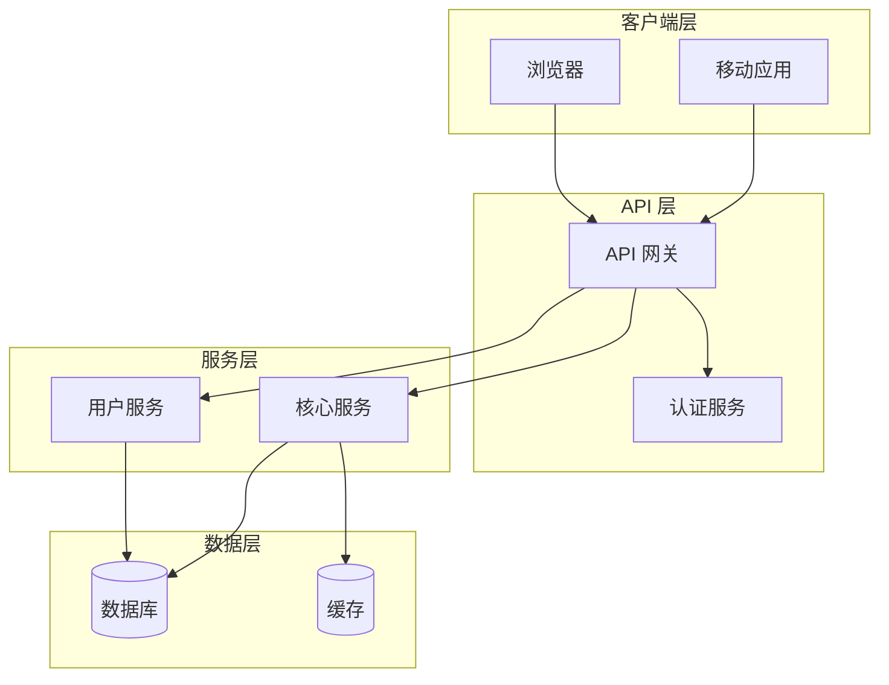
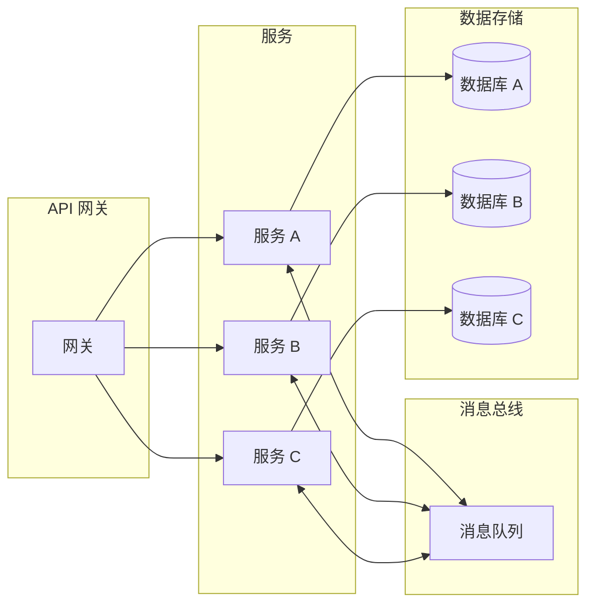
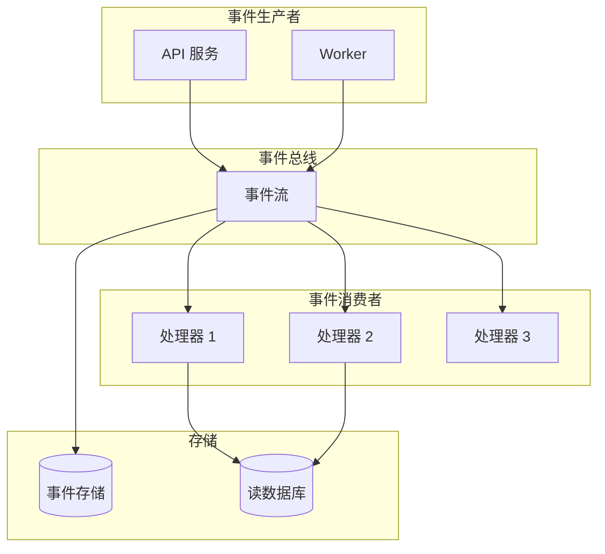
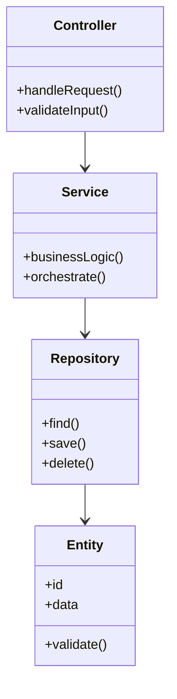
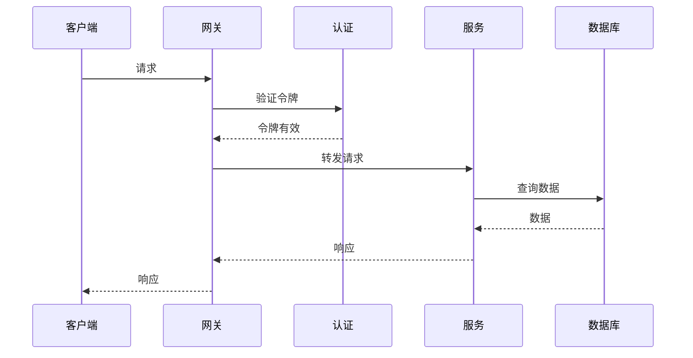
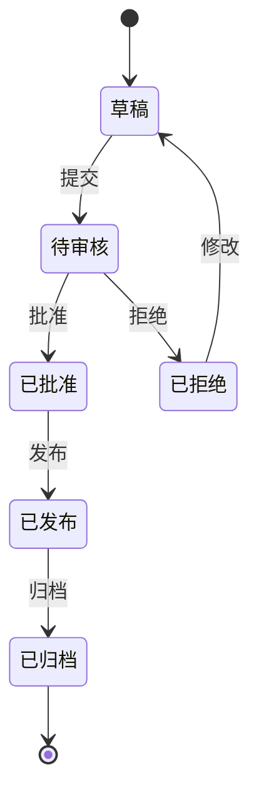
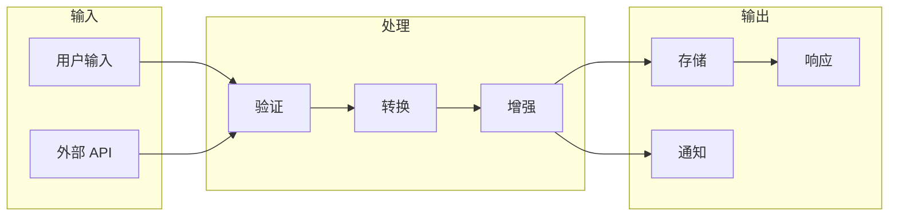
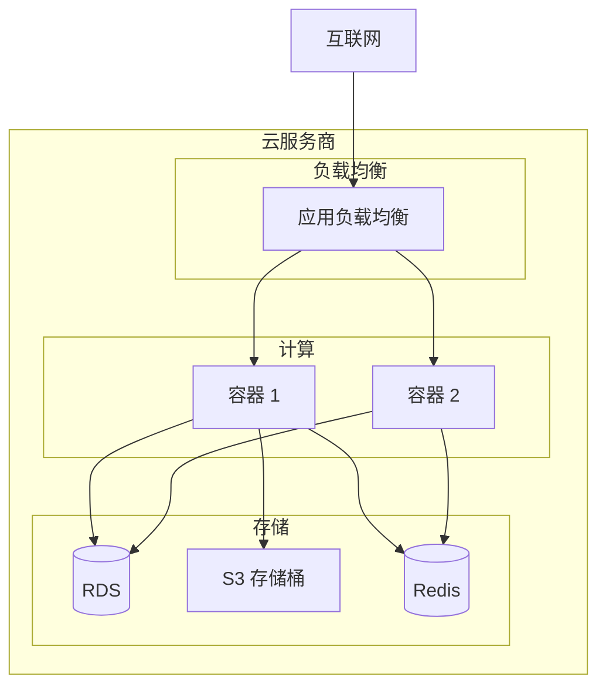

# 架构图模板

常见 SDD 架构的 Mermaid 图模板。

## 基础 Web 应用

## 微服务架构

## 事件驱动架构

## 组件图

## 时序图 - 请求流程

## 状态机

## 数据流图

## 部署图

## 使用说明

1. 复制相关模板
2. 用实际组件名替换占位符名称
3. 调整关系以匹配你的架构
4. 根据需要添加或删除组件
5. 使用一致的命名规范
