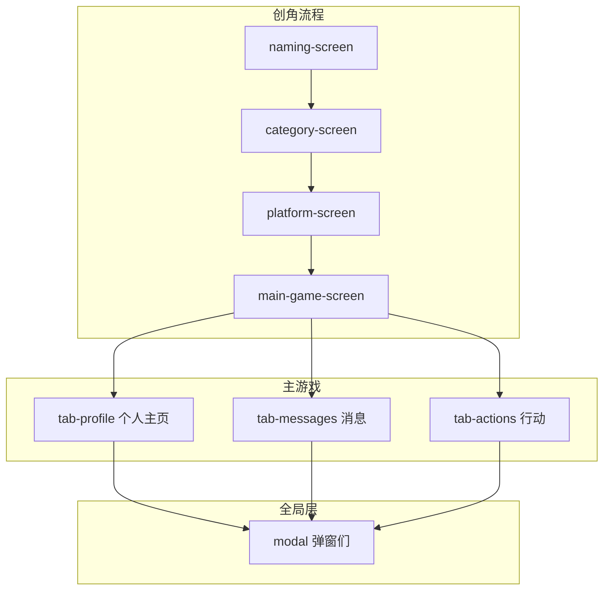

# 技术方案：移动端适配与模块划分优化

**Task ID:** mobile-adapt-module-refactor  
**状态:** 待实现  
**依据:** feature-brief.md

---

## 1. 系统架构

### 概览

本方案不引入新框架，在现有单页多屏结构上做**响应式增强**与**模块边界显式化**。前端仅包含视图层：创角流程（3 屏）→ 主游戏（1 屏 + 3 Tab）→ 全局弹窗；数据与逻辑仍由 `game.js` / `config.js` / `events.js` 等维持，不新增数据层或 API。

### 架构图

### 架构决策表

| 决策 | 选择 | 理由 |
|------|------|------|
| 响应式策略 | 媒体查询 + 移动优先新增样式 | 与 brief 一致；现有 768px 保留，新增小屏优先规则，桌面在原有基础上扩展 |
| 断点体系 | 保留 768px，可选增加 480px、320px | 320/375/414 覆盖主流手机；480 用于创角或行动区微调（待盘点后定） |
| 模块边界 | 语义化 class + 注释，不拆文件 | 保持单页、单 CSS 文件，用 class 前缀或区块注释标识创角/主游戏/弹窗，便于维护与后续拆分 |
| DOM 变更 | 仅增 class 或包裹层，不改 ID 与事件绑定 | 避免破坏 `ui.js` / `game.js` 中基于 id 的查询与 `data-tab` 等绑定 |
| 触控热区 | 关键按钮/链接 min-height/min-width 44px，或 padding 保证 | 满足移动端可点性，符合 WCAG 等常见建议 |

---

## 2. 技术栈

| 层级 | 技术 | 版本/说明 | 理由 |
|------|------|-----------|------|
| 标记 | HTML5 | — | 沿用现有，语义化标签与 aria 保持 |
| 样式 | CSS3 | 媒体查询、Flexbox、Grid、clamp()、env() | 已有基础；安全区用 `env(safe-area-inset-*)` |
| 逻辑 | 原生 JavaScript | ES5+，无构建 | 与现有 js/ 一致，不引入打包 |
| 依赖 | 无 | — | 无新增 npm 包或 CDN |

---

## 3. 组件设计

### 3.1 视图模块（DOM 区块）

| 组件 | 用途 | 职责 | 对应选择器/ID |
|------|------|------|----------------|
| 创角-起名 | 昵称、性别、头像、属性 | 收集创角信息并校验，一步提交 | `#naming-screen` |
| 创角-类别 | 选择网红类别 | 单选并进入下一屏 | `#category-screen` |
| 创角-平台 | 选择起步平台 | 单选并进入主游戏 | `#platform-screen` |
| 主游戏-容器 | 三 Tab 外壳 | 提供顶部状态栏 + 内容区 + 底部 Tab 导航 | `#main-game-screen.main-game-with-tabs` |
| 主游戏-个人主页 | 身份/数值/发现 | 展示头像、粉丝/存款/违规、热搜与推荐 | `#tab-profile` |
| 主游戏-消息 | 小助理/评论与事件/日志 | 入口卡片 + 事件列表 + 日志区 | `#tab-messages` |
| 主游戏-行动 | 属性条/行动列表/结算 | 精力心态质量人设、本月行动、平台管理、结算本月 | `#tab-actions` |
| 全局弹窗 | 事件/月度/游戏结束/说明等 | 模态展示，统一关闭与焦点 | `#event-modal` 等 `.modal` |

### 3.2 CSS 模块与断点

- **全局与容器**：`body`、`#game-container` 在移动端可缩小 padding、max-width 保持或改为 100%。
- **创角**：`.content-box`、`.attribute-list`、`.gender-list`、`.avatar-list` 等在小屏下字号、间距、网格列数由媒体查询覆盖。
- **主游戏**：`.status-bar-compact`、`.tab-content-area`、`.tab-panel`、`.bottom-tab-nav` 为关键区域；底部导航需保证安全区与 44px 触控高度。
- **断点建议**：
  - `max-width: 768px`：现有断点，保留并作为「平板/手机」主断点。
  - `max-width: 480px`（可选）：创角单列、行动列表单列、Tab 文案缩短或仅图标。
  - `max-width: 320px`（可选）：仅做最小字号与 padding 兜底。

### 3.3 与现有 JS 的接口

- **不新增 JS 接口**。`ui.js` 中 `switchScreen(screenId)`、`switchMainTab(tabId)` 及各类 `getElementById` / `querySelector` 保持不变。
- **可选**：在 HTML 上为某几个区块增加 `data-module="naming"` 等属性，仅用于文档/注释，不参与逻辑。

---

## 4. 数据模型

无新增数据模型。游戏状态仍在 `game.js` 的 `InfluencerGame.state` 及 `GameConfig` 中；本方案仅影响展示与布局，不改变状态结构或存储。

---

## 5. API 契约

不涉及后端或前端 API；无新增接口。

---

## 6. 安全考虑

- 本项目为静态前端，无用户认证或敏感数据传输。
- 若有通过 iframe 或外部链接嵌入的第三方内容，需继续遵循现有同源策略；本方案不引入新脚本或外部资源。

---

## 7. 性能策略

- **避免强制同步布局**：在移动端样式中避免在滚动或切换 Tab 时触发布局抖动；固定底栏使用 `position: fixed` 或 `sticky` 时注意 `padding-bottom` 与内容区一致，避免重复重排。
- **关键路径**：不新增阻塞渲染的脚本；CSS 仍单文件加载，若未来文件过大可考虑按模块拆分为多 CSS（本阶段不必须）。
- **触控与滚动**：为 `.tab-panel` 保留 `overflow-y: auto; overflow-x: hidden`，避免整页滚动与内部滚动冲突。

---

## 8. 实现阶段

### 阶段 1：现状盘点与设计对齐（约 2–4 小时）

- [ ] 在 320 / 375 / 414 / 768 视口下走查：创角三屏 → 主游戏三 Tab → 主要弹窗（事件、月度、游戏结束、说明）。
- [ ] 记录布局错位、文字截断、点击困难、滚动冲突、底栏遮挡，形成**问题清单**（可放在 `specs/active/mobile-adapt-module-refactor/` 下如 `audit-mobile.md`）。
- [ ] 确认主游戏「顶-中-底」信息分区与三 Tab 的对应关系，与 brief 中「数值→消息→行动」一致；如需可画简单线框图或列表说明。

### 阶段 2：移动端样式与触控（约 4–6 小时）

- [ ] 按问题清单在 `css/style.css` 中增加或修改媒体查询（`max-width: 768px`，必要时 480px/320px）。
- [ ] 调整创角区：`.content-box` 内边距、`.attribute-list` 网格、输入框与按钮字号/高度，保证关键触控区 ≥44px。
- [ ] 调整主游戏：状态栏、三 Tab 内容区 padding、列表与卡片单列/双列；底部 `.bottom-tab-nav` 高度与安全区 `padding-bottom: env(safe-area-inset-bottom)`。
- [ ] 弹窗：`.modal-content` 在小屏下 max-width、padding、字号与滚动，确保无横向溢出。

### 阶段 3：模块边界标注（约 1–2 小时）

- [ ] 在 `index.html` 中为创角三屏、主游戏容器、三 Tab、全局弹窗增加注释或统一 class（如 `m-module-naming`、`m-module-main-tabs`、`m-module-modal`），不改变现有 id 与 `data-tab`。
- [ ] 在 `css/style.css` 中按区块增加注释（创角 / 主游戏-个人主页 / 消息 / 行动 / 全局弹窗），便于后续按模块查找或拆分。
- [ ] 在 `js/ui.js` 或相关文件中确认事件绑定与各 screen/tab 的对应关系，必要时在关键函数上方加简短注释。

### 阶段 4：验证与收尾（约 2 小时）

- [ ] 在 375px 及 768px 下复测：创角完整流程、主游戏三 Tab 切换、主要弹窗打开/关闭、结算本月与游戏结束。
- [ ] 检查桌面端（≥768px）无布局或样式回归。
- [ ] 若有真机，在至少一台设备上做快速验证；否则用 DevTools 设备模式与不同分辨率确认。

### 可选（锦上添花）

- [ ] 创角在 480px 以下改为分步展示或折叠区块，减少首屏滚动。
- [ ] 320px 下底部 Tab 仅图标或图标+短文案，避免拥挤。

---

## 9. 风险评估

| 风险 | 影响 | 可能性 | 缓解措施 |
|------|------|--------|----------|
| 桌面端样式回归 | 中 | 中 | 每次改媒体查询后在 ≥768px 下回归测试；优先在 max-width 内写规则，少动全局样式 |
| 断点冲突或优先级混乱 | 低 | 中 | 统一断点顺序（如先 320 再 480 再 768），避免多处覆盖同一属性导致难排查 |
| 底栏遮挡内容 | 中 | 中 | 各 `.tab-panel` 已设 `padding-bottom: 80px`，移动端可调为 56px + safe-area，并确认无内容被挡 |
| 新增 class 与现有样式冲突 | 低 | 低 | 使用前缀（如 `m-module-*`）或仅注释不增 class，减少特异性冲突 |

---

## 10. 待解决问题

- **480px 断点**：是否增加、仅用于创角或仅用于行动列表，在阶段 1 盘点后根据问题清单决定。
- **320px 底部 Tab**：是否改为仅图标或缩短文案，在阶段 2 实测后决定。
- **创角分步/折叠**：若阶段 1 发现首屏滚动过多再考虑，不作为首轮必须项。

---

## 下一步

- 评审本技术方案，确认断点与模块边界无遗漏。
- 运行 `/tasks mobile-adapt-module-refactor` 生成可执行的任务列表（可选，因阶段已含复选框）。
- 按阶段 1 开始执行：先做现状盘点与问题清单，再进入阶段 2 样式修改。
